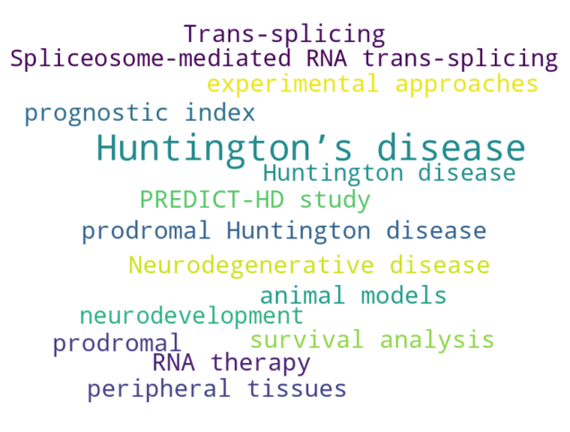

# Huntington’s Disease Mini Project

##  How to use this repository?

Clone the project:

```bash
git clone git@github.com:dewei-lin/mini-HD-project.git
cd mini-HD-project
```

Then, you would need to build the Docker image for this project with Docker:

```bash
docker build -t hd .
```

Start an RStudio server by running:

```bash
docker run   -v $(pwd):/home/rstudio/mini-hd-project\
  	     -p 8787:8787\
	     -e PASSWORD=611isfun\
             -it hd
```

You then visit http://localhost:8787 via a browser on your machine to access the machine and development environment.


To generate the plots with Makefile:

```bash
make all
```

To run the Shiny app:

```bash
docker run -p 3838:3838 -v $(pwd):/project mini-hd-project make run-shiny
```

And visit in your local computer at http://127.0.0.1:3838 . Or directly visit the R shiny app in web browser without running the script: https://dewei-lin.shinyapps.io/survival_compare/ 


##  What is Huntington’s Disease?

Huntington’s disease (HD) is a rare, inherited neurodegenerative disorder caused by a genetic mutation in the HTT gene. The mutation leads to an abnormal repetition of the CAG trinucleotide sequence, resulting in progressive brain cell damage. Symptoms of HD typically appear between the ages of 30 and 50 and include motor dysfunction, cognitive decline, and psychiatric disturbances.

To better illustrate the rapid progression of Huntington’s disease, here is an animation:


<div align="center">  </div>

This animation demonstrates how quickly the disease can advance, emphasizing the need for early intervention and continuous care.

---

##  Research Keywords in Huntington’s Disease

There are many research in Huntington’s disease studies. Below is a visual representation of keywords scrapped from some of scientific literature, showcasing the most discussed terms in this field.

<div align="center">  </div>

---

##  Helping Patients with Decision-Making

One critical aspect of Huntington’s disease is helping patients make life decisions based on their genetic predisposition. Specifically, the number of CAG repeats in the HTT gene and the patient’s age are crucial in estimating the likelihood of disease onset and progression.

While research offers various models to predict outcomes, comparing different approaches is necessary to guide tailored interventions. For instance, there are two models in the practical use of predicting HD progression, CAP (Zhang et al., 2011) and Langbehn model (Langbehn et al., 2004). In order to demonstrate the similarities as well as the differences between two models, an interactive R shiny app is created for both statisticians and non-statisticians:


👉 [Launch the HD Prediction App](https://dewei-lin.shinyapps.io/survival_compare/)


Stay tuned as we continue building tools and models to support HD patients and their families in navigating this challenging journey.


## References

- Langbehn DR, Brinkman RR, Falush D, Paulsen JS, Hayden MR, on behalf of the International Huntington’s Disease Collaborative Group. *A new model for prediction of the age of onset and penetrance for Huntington’s disease based on CAG length*. Clin Genet. 2004;65:267–277. [DOI](https://doi.org/10.1111/j.0009-9163.2004.00218.x)

- Zhang Y, Long JD, Mills JA, Warner JH, Lu W, Paulsen JS, and the PREDICT-HD Investigators and Coordinators of the Huntington Study Group. *Indexing Disease Progression at Study Entry With Individuals At-Risk for Huntington Disease.* 2011.